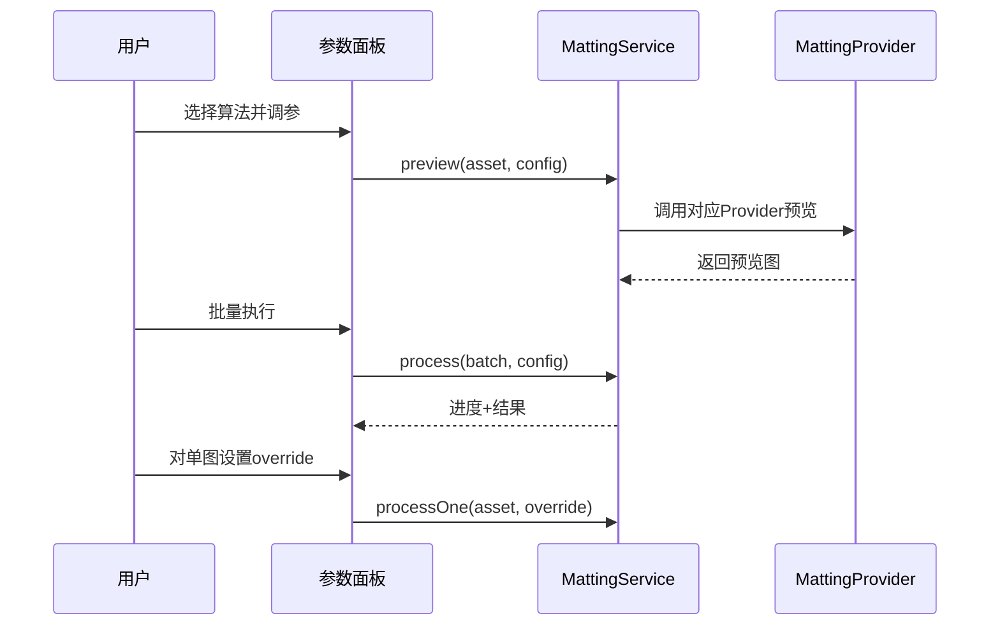
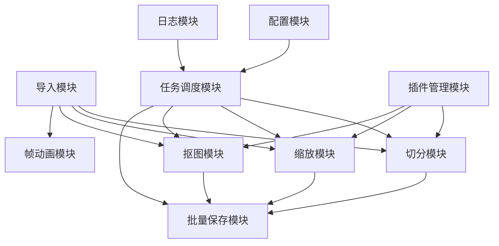

# 美术素材处理工具功能模块详细设计文档

- 文档版本：v1.0
- 创建日期：2026-06-28
- 来源基线：`docs/需求文档.md` v1.1 + `docs/技术方案.md` v1.2 + `docs/架构设计文档.md` v1.0
- 当前实现平台：Linux

## 1. 模块清单

1. 文件导入与素材管理模块
2. 切分模块
3. 缩放模块（仅缩小）
4. 抠图模块（三档算法 + 单张例外参数）
5. 帧动画模块
6. 批量保存与命名模块
7. 任务调度与进度模块
8. 插件管理模块（运行时动态加载）
9. 配置与预设模块
10. 日志与错误处理模块

## 2. 文件导入与素材管理模块

### 2.1 职责
- 导入 PNG/JPG/WebP/BMP 文件。
- 读取元数据（尺寸、格式、路径、修改时间）。
- 维护素材列表、多选状态、分组标签。

### 2.2 核心数据
- `ImageAsset { id, path, width, height, format, selected }`

### 2.3 关键接口
- `importFiles(paths[]) -> ImageAsset[]`
- `removeAsset(id) -> void`
- `toggleSelect(id, selected) -> void`

### 2.4 异常
- 非支持格式：`UNSUPPORTED_FORMAT`
- 文件不可读：`FILE_READ_DENIED`

## 3. 切分模块

### 3.1 功能范围
- 三种切分计算模式：
  1) 指定分辨率；
  2) 指定横竖数量；
  3) 自动/手动切分线提取（自动策略：边缘检测 + 投影峰值）。
- 切分锚点：左上/中心（仅影响参考坐标）。
- 编号策略：默认按行遍历（左上到右下）。
- 边缘不足透明补齐。

### 3.2 输入
- `SliceConfig`
  - `mode, sliceWidth, sliceHeight, countX, countY, linesX, linesY, offsetX, offsetY, anchorMode, numberingStrategy, edgeStrategy`

### 3.3 输出
- `SliceResult[]`
  - `index, rect, outputWidth, outputHeight, previewThumb`

### 3.4 核心流程

### 3.5 验收点
- 预览线与导出一致。
- 所有切片尺寸一致（默认补边策略下）。

## 4. 缩放模块（仅缩小）

### 4.1 功能范围
- 单图/批量缩放。
- 按比例或目标尺寸。
- 禁止放大。

### 4.2 输入
- `ScaleConfig { mode, ratios[], targetSizes[], algorithm, keepAspect, downscaleOnly=true }`

### 4.3 输出
- `ScaleResult[] { sourceId, ratioOrSize, outputPath?, previewThumb }`

### 4.4 校验规则
- 若目标尺寸大于原图尺寸：返回 `UPSCALE_NOT_ALLOWED`。

## 5. 抠图模块

### 5.1 功能范围
- 单图调参预览。
- 批量应用参数。
- 批量后单张图片例外参数覆盖。
- 算法三档：`AI通用(ONNX Runtime)` / `纯色色键` / `灰白方格专用`。

### 5.2 输入
- `MattingConfig { algorithm, threshold, smooth, denoise, feather, edgePreference, model }`
- `MattingOverride { assetId, overrideConfig }`

### 5.3 输出
- `MattingResult { assetId, alphaStats, outputPreview, warnings[] }`

### 5.4 流程

### 5.5 异常
- ONNX 模型缺失：`ONNX_MODEL_NOT_FOUND`
- 推理超时：`MATTING_PROVIDER_TIMEOUT`
- 参数非法：`INVALID_MATTING_CONFIG`

## 6. 帧动画模块

### 6.1 功能范围
- 批量帧导入。
- 播放/暂停/循环，FPS 调节。
- 删除帧、拖拽排序。

### 6.2 数据
- `FrameTimeline { frames: FrameItem[], fps, loop }`

### 6.3 关键接口
- `setFps(fps)`
- `deleteFrame(frameId)`
- `moveFrame(fromIndex, toIndex)`
- `play()/pause()`

## 7. 批量保存与命名模块

### 7.1 功能范围
- 多选结果批量导出。
- 统一输出格式：PNG/BMP/WebP（三选一）。
- 命名规则：`prefix + '_' + pad(index, digits) + suffix + ext`。

### 7.2 输入
- `ExportRule { prefix, startIndex, digits, suffix, conflictPolicy, outputDir, format }`

### 7.3 冲突策略
- `AUTO_RENAME`（默认）
- `OVERWRITE`
- `SKIP`

## 8. 任务调度与进度模块

### 8.1 目标
- 所有长任务异步执行。
- 默认并发：$max(1, CPU-1)$。

### 8.2 状态模型
- `TaskStatus = PENDING | RUNNING | SUCCESS | FAILED | CANCELED`

### 8.3 接口
- `enqueue(task)`
- `cancel(taskId)`
- `subscribeProgress(taskId, cb)`

## 9. 插件管理模块（运行时动态加载）

### 9.1 范围
- 扫描 `plugins/`。
- 加载 Provider manifest 与入口。
- 记录可用能力。

### 9.2 Manifest 建议
- `id, type, version, displayName, entry, capabilities, runtime`

### 9.3 异常隔离
- 单插件加载失败不影响其他插件。
- 失败插件进入禁用清单并显示原因。

## 10. 配置与预设模块

### 10.1 配置文件
- `app_config.json`
- `presets.json`
- `recent.json`

### 10.2 关键字段
- `concurrency`（默认 `$CPU-1`）
- `selectedProviders`
- `schemaVersion`

### 10.3 迁移
- 启动时检测 `schemaVersion`，必要时自动迁移并备份。

## 11. 日志与错误处理模块

### 11.1 日志维度
- 任务日志：任务级耗时、成功率。
- 文件日志：文件级结果与错误码。
- 插件日志：`providerId/providerVersion`。

### 11.2 错误码示例
- `UNSUPPORTED_FORMAT`
- `UPSCALE_NOT_ALLOWED`
- `ONNX_MODEL_NOT_FOUND`
- `MATTING_PROVIDER_TIMEOUT`
- `EXPORT_PERMISSION_DENIED`

## 12. 模块间协作关系

## 13. 开发优先级建议

### P0（必须）
- 导入、切分、缩放（仅缩小）、批量保存。
- 任务调度与进度。
- 抠图 `AI通用` 基础链路（ONNX Runtime）。

### P1（高优先）
- 抠图三档算法全接入。
- 单张例外参数。
- 插件动态加载机制。

### P2（增强）
- 更丰富的编号策略。
- 插件签名与安全校验。
- Windows 迁移验证脚本。

## 14. 模块级验收清单

- [ ] 切分三模式均可用，预览与导出一致。
- [ ] 缩放严格禁止放大。
- [ ] 抠图三档算法均可运行，AI链路使用 ONNX Runtime。
- [ ] 批量后可对单张做例外参数重跑。
- [ ] 插件可在运行时动态识别并注册。
- [ ] 默认并发为 `$CPU-1` 并具备最小值保护。
