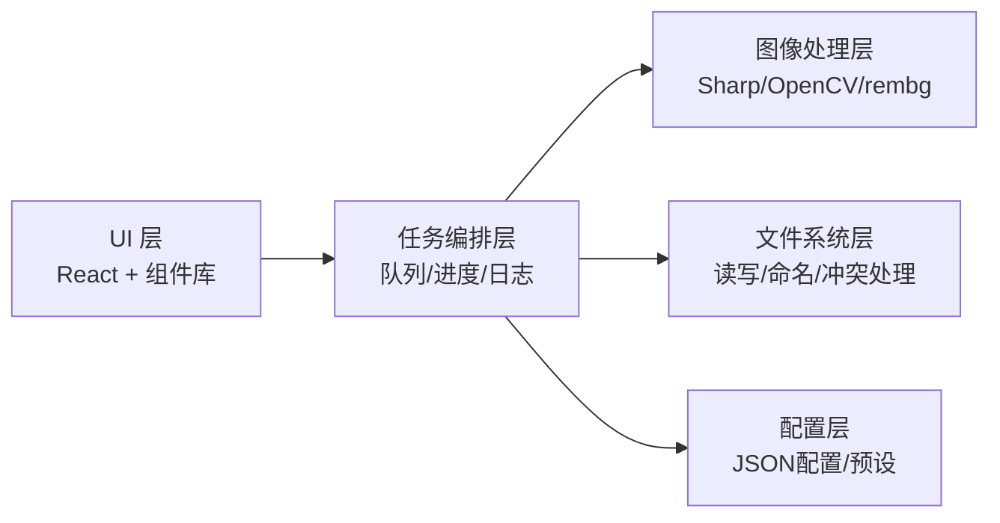
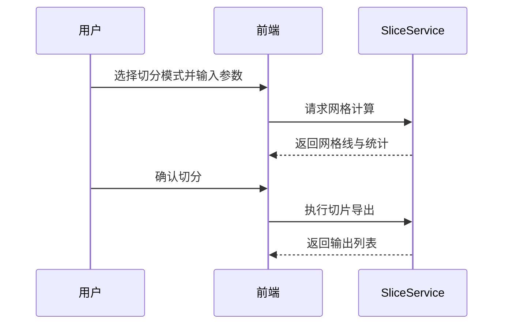

# 美术素材处理工具技术方案

- 文档版本：v1.3
- 创建日期：2026-06-28
- 对应需求：`docs/需求文档.md`
- 目标阶段：MVP
- 当前版本里程碑：V1

## 1. 技术目标

围绕“高频图片处理 + 可视化预览 + 稳定批处理”，实现一个本地桌面工具，满足：

1. 图像切分（预览网格、确认导出）
2. 多分辨率缩放（单图/批量，仅缩小）
3. 抠图（单图调参、批量复用）
4. 帧动画预览与帧序管理（删除/拖拽排序）
5. 批量保存与命名（前缀+序号）

## 2. 总体架构

采用 **桌面端前后分层架构**：

- 前端（UI 层）：负责交互、预览、任务配置、进度展示
- 核心服务层（任务编排）：负责参数校验、任务调度、进度事件
- 图像处理层（算法执行）：负责切分/缩放/抠图/导出
- 存储层（本地文件 + 配置）：负责文件读写与参数持久化

### 2.1 平台策略（Linux 优先，面向未来跨平台）

- 当前目标平台：Linux（首发且当前仅实现 Linux 运行与发布）。
- 未来目标平台：Windows（本阶段不考虑发布要求与安装流程）。
- 研发策略：
  1. Linux 先实现全部业务能力与稳定性基线；
  2. 抽象平台差异层，保持 Windows 可迁移性；
  3. 当前里程碑以 Linux 验收为准，Windows 仅保留设计预留。
- 平台差异抽象点：
  - 路径与分隔符（`PathService` 统一处理）
  - 文件对话框与权限差异（`PlatformBridge` 封装）
  - 外部算法运行时定位（ONNX/动态库路径）
  - 打包与安装器差异（当前只实现 Linux 打包链路）

### 2.2 模块化设计原则

- 依赖方向固定：`UI -> Core -> Service Interface -> Provider`。
- 业务层只依赖“接口”，不依赖具体算法实现。
- 所有算法能力通过能力声明注册（而不是写死分支判断）。
- 新增算法必须可在不改 UI 主流程代码的前提下接入。
- 插件加载采用运行时动态发现与注册（支持热插拔扫描，首版可在应用启动时加载）。

## 3. 技术选型建议

### 3.1 桌面框架

- **Tauri + React + TypeScript（推荐）**
  - 优点：包体小、性能好、跨平台能力强、原生文件访问方便
  - Rust 后端适合承接高性能处理与并发任务

> 备选：Electron + React（生态成熟，但包体更大）

### 3.2 图像处理库

- 切分/缩放：
  - 优先采用 Rust `image` crate（输入支持 PNG/JPG/WebP/BMP，输出支持 PNG/BMP/WebP）
  - 若引入 `sharp`，作为高性能补充路径（需注意 BMP 输出能力与统一封装）
- 抠图：
  - 算法列表机制：
    - AI 通用抠图（ONNX Runtime）
    - 纯色背景色键抠图（Chroma Key）
    - 仿透明灰白方格背景专用分离算法
  - 通过统一 `MattingProvider` 接口屏蔽算法差异
  - AI 推理运行时：**ONNX Runtime（固定）**
- 帧动画预览：
  - 前端 Canvas/WebGL 渲染，按 FPS 定时播放

### 3.3 数据与配置

- 本地 JSON：
  - `app_config.json`（默认设置）
  - `presets.json`（抠图参数预设）
  - `recent.json`（最近路径与最近任务）

## 4. 模块设计

## 4.1 UI 模块

1. **工作区面板**：文件导入、结果列表、多选
2. **预览面板**：
   - 切分网格叠加
   - 抠图前后对比
   - 帧动画预览
3. **参数面板**：按处理模式展示参数
4. **任务面板**：进度条、成功/失败统计、日志导出

## 4.2 核心服务模块

- `TaskManager`：任务生命周期管理（创建、取消、完成）
- `JobQueue`：串行/并行调度（默认并行度 = CPU 核数 - 1，即 $CPU - 1）
- `ProgressBus`：向 UI 推送进度事件
- `ResultStore`：缓存处理结果索引，供批量保存使用

新增建议：
- `ProviderRegistry`：算法提供者运行时动态加载、注册与能力发现（支持启用/禁用）
- `PlatformBridge`：平台能力封装（路径、对话框、系统信息、安装目录）
- `ConfigService`：配置版本管理与迁移（`v1 -> v2` 自动迁移）

## 4.3 图像处理模块

- `SliceService`：三种切分模式（指定尺寸/指定数量/线条提取）、顺序编号、透明补边
- `ScaleService`：按比例或目标尺寸缩放（仅允许缩小）
- `MattingService`：单图抠图预览、批量执行、单张文件例外参数覆盖
- `AnimationService`：帧序维护（删除/移动）
- `ExportService`：命名、冲突处理、输出目录写入

### 4.4 算法可插拔协议（关键补充）

定义统一算法接口，后续新增/替换算法时仅新增 Provider：

- `ISliceProvider`
- `IScaleProvider`
- `IMattingProvider`

以抠图为例，建议接口能力：

- `id`：算法唯一标识（如 `matting.ai.general.v1`）
- `displayName`：界面显示名称
- `capabilities`：能力声明（支持背景类型、速度档位、是否支持边缘偏好）
- `getDefaultConfig()`：默认参数
- `validateConfig(config)`：参数校验
- `preview(input, config)`：单图预览
- `process(input, config)`：批处理执行

版本策略：

- Provider 语义化版本（`major.minor.patch`）
- 配置中记录 `providerId + providerVersion`
- 发生破坏性升级时由 `ConfigService` 做参数迁移

加载策略（首版）：

- 启动时扫描插件目录（如 `plugins/`）并动态加载 Provider。
- Provider 需暴露清单（manifest）声明 `type/id/version/capabilities/entry`。
- 加载失败的插件进入隔离列表，不影响主流程。

## 5. 核心流程设计

### 5.1 切分流程

关键点：
- 预览与实际输出必须共用同一坐标计算逻辑，避免偏差。
- 边缘不足时统一透明补边，保证切片尺寸一致。
- “中心”仅用于切分参考锚点。
- 默认编号顺序为按行遍历（左上到右下），并预留编号策略扩展。

### 5.2 抠图流程（先单图后批量）

1. 单图模式：在三档算法中选择其一并实时调参预览（阈值、羽化、去噪、平滑、边缘偏好）
2. 参数确认：保存为“当前参数集”
3. 批处理模式：将参数集应用到全部输入
4. 批处理后对单张异常文件应用例外参数并增量重跑
5. 失败项记录：文件名 + 错误原因

算法首版固定三档：
- `AI通用`
- `纯色色键`
- `灰白方格专用`

### 5.3 批量保存命名流程

命名规则：

$$name = prefix + '_' + pad(index, digits) + optionalSuffix + '.' + ext$$

例如：`hero_001_bg.png`、`hero_002_bg.png`

输出格式策略：
- 批次内统一输出格式（`PNG` / `BMP` / `WebP` 三选一）

冲突处理优先级（默认）：自动重命名 > 覆盖 > 跳过（可配置）

## 6. 数据结构建议（TypeScript）

- `ImageAsset`
  - `id, path, width, height, format, selected`
- `SliceConfig`
  - `mode, sliceWidth, sliceHeight, countX, countY, linesX, linesY, offsetX, offsetY, anchorMode, numberingStrategy, edgeStrategy`
- `ScaleConfig`
  - `mode, ratios[], targetSizes[], algorithm, keepAspect, downscaleOnly`
- `MattingConfig`
  - `algorithm, threshold, smooth, denoise, feather, edgePreference, model`
- `MattingOverride`
  - `assetId, overrideConfig`
- `FrameTimeline`
  - `frames: FrameItem[]`, `fps`, `loop`
- `ExportRule`
  - `prefix, startIndex, digits, suffix, conflictPolicy, outputDir, format`

- `ProviderMeta`
  - `id, type, version, displayName, capabilities, enabled`
- `AppConfig`
  - `platform, defaultOutputFormat, concurrency, selectedProviders, schemaVersion`

## 7. 性能与稳定性策略

1. 长任务异步化，主线程仅做 UI 渲染
2. 批处理并发限制，避免内存峰值过高
3. 预览图使用降采样缓存，减少重复解码
4. 所有任务支持中断与重试
5. 错误隔离：单文件失败不影响全局

## 8. 日志与可观测性

- 任务级日志：开始/结束时间、耗时、成功率
- 文件级日志：输入路径、输出路径、错误信息
- 导出日志：支持 JSON/CSV

补充：
- 日志附带 `platform/osVersion/providerId/providerVersion`，用于跨平台问题定位。
- 统一错误码（如 `MATTING_PROVIDER_TIMEOUT`、`EXPORT_PERMISSION_DENIED`）。

## 9. V1 交付计划（建议 4~6 周）

### 阶段 A：基础能力（第 1~2 周）
- 项目骨架（Tauri + React + TS）
- 文件导入、缩略图列表、配置持久化
- 切分预览 + 导出

### 阶段 B：批处理能力（第 3 周）
- 缩放（比例/尺寸）
- 批量保存与命名规则
- 任务进度与错误日志

### 阶段 C：抠图能力（第 4~5 周）
- 单图调参与预览
- 批量抠图复用参数
- 输出质量和速度优化

### 阶段 D：动画能力与收尾（第 6 周）
- 帧动画预览、删帧、拖拽排序
- 集成测试、打包、使用文档

## 10. 测试方案

- 单元测试：
  - 命名生成、网格计算、参数校验
- 集成测试：
  - 批处理任务流（导入→处理→导出）
- 回归测试：
  - 不同格式 PNG/JPG/WebP/BMP + Alpha 场景
- 视觉验收：
  - 切分线一致性、抠图边缘、动画顺序正确性

补充跨平台测试矩阵：

- Linux（首发）
  - Ubuntu LTS：功能全量 + 性能基线
- Windows（未来阶段）
  - 当前不纳入发布验收；仅保留兼容性设计检查项

## 11. 已冻结实现约束（v1.1，2026-06-28）

- 切分自动线提取首版算法：边缘检测 + 投影峰值。
- 切分锚点 `center` 仅影响切分参考坐标，不改变编号顺序。
- 编号默认策略：按行遍历（左上到右下）。
- 抠图算法首版固定三档：`AI通用` / `纯色色键` / `灰白方格专用`。
- 例外参数仅支持单张图片覆盖。
- 缩放仅支持 downscale。

## 12. 新增冻结技术决议（v1.2，2026-06-28）

- AI 推理运行时固定为 `ONNX Runtime`。
- 算法模块采用运行时动态加载插件机制。
- 默认并发策略为 `$CPU - 1`（最小值保护建议为 1）。
- 当前仅实现 Linux 平台；Windows 仅保留未来跨平台扩展设计，不纳入当前发布范围。

## 13. 风险与应对

1. 抠图效果波动
   - 应对：预设多档参数 + 单图调参先行
2. 大图批处理内存占用高
   - 应对：分片加载、并发限流、临时缓存清理
3. 跨平台图像库差异
   - 应对：统一封装处理接口，增加平台冒烟测试

## 14. 目录结构建议

- `src/ui`：界面与组件
- `src/core`：任务编排与状态管理
- `src/services`：图像处理服务
- `src/utils`：命名、校验、日志工具
- `src/types`：类型定义
- `native/`：Tauri/Rust 原生桥接
- `docs/`：需求与方案文档

建议补充：

- `src/providers/`：算法 Provider 实现（按类型分目录）
- `src/contracts/`：接口协议与能力声明
- `src/platform/`：平台桥接层
- `tests/matrix/`：跨平台回归用例

## 15. 后续可扩展方向

- 智能裁切（自动识别角色边界）
- 精细蒙版编辑（画笔修边）
- 动画导出 GIF/WebP/APNG
- 团队共享预设与流水线集成（CI 资源处理）
