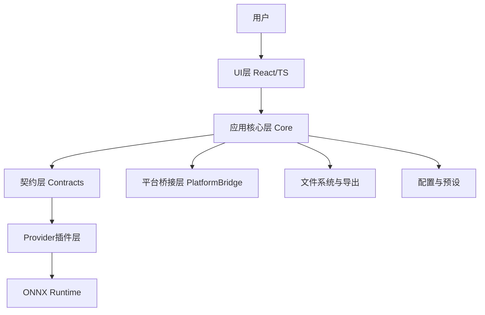
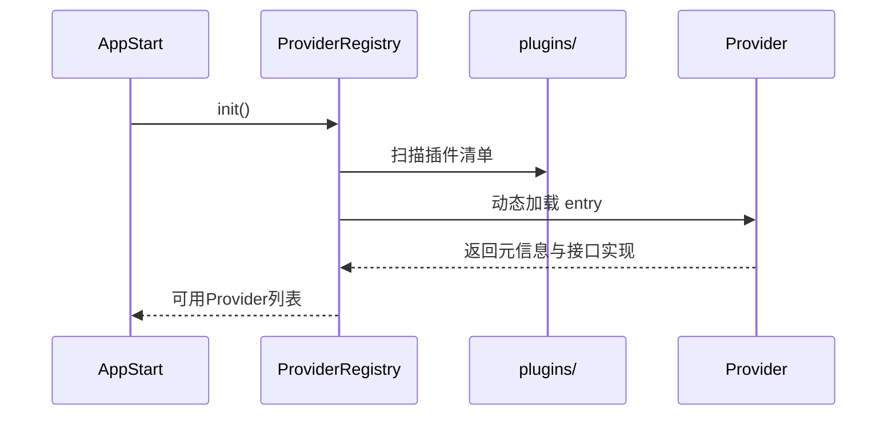

# 美术素材处理工具架构设计文档

- 文档版本：v1.0
- 创建日期：2026-06-28
- 来源基线：`docs/需求文档.md` v1.1 + `docs/技术方案.md` v1.2
- 当前交付平台：Linux
- 架构目标：高内聚、低耦合、可替换算法、可扩展到 Windows

## 1. 架构目标与原则

### 1.1 目标

1. 满足 MVP 核心能力：切分、缩放（仅缩小）、抠图、帧动画、批量保存。
2. Linux 平台稳定可用，后续可迁移到 Windows。
3. 图像算法模块可运行时动态加载，支持新增/替换。
4. 抠图 AI 统一使用 ONNX Runtime，避免多运行时分裂。

### 1.2 架构原则

- 分层解耦：UI 不直接依赖算法实现。
- 接口优先：业务只依赖契约（Contracts）。
- 插件可插拔：算法实现通过 Provider 注册。
- 失败隔离：单插件或单任务失败不影响整体。
- 可观测：全链路日志可定位到 Provider 与平台。

## 2. 系统上下文与分层

## 3. 逻辑架构

### 3.1 层次说明

1. **UI 层（`src/ui`）**
   - 面板交互、参数输入、预览渲染、任务状态展示。
2. **Core 层（`src/core`）**
   - 任务编排、状态管理、结果索引、错误收敛。
3. **Contracts 层（`src/contracts`）**
   - 服务接口、Provider 协议、能力声明模型。
4. **Providers 层（`src/providers` + `plugins/`）**
   - 切分/缩放/抠图算法实现（内置或外部插件）。
5. **Platform 层（`src/platform`）**
   - 路径、系统目录、文件选择器、平台特性封装。
6. **Infra 层（`src/utils` + native）**
   - 文件读写、日志、缓存、序列化、Rust 调用桥接。

### 3.2 依赖约束

依赖方向固定：

$$UI \rightarrow Core \rightarrow Contracts \rightarrow Providers$$

- 禁止 `UI -> Providers` 直接依赖。
- 禁止 Provider 反向依赖 Core。
- 平台特性必须经 `PlatformBridge` 调用。

## 4. 关键组件设计

### 4.1 TaskManager

职责：
- 创建任务、取消任务、状态迁移。
- 聚合子任务进度并推送给 UI。

状态机建议：
- `PENDING -> RUNNING -> SUCCESS | FAILED | CANCELED`

### 4.2 JobQueue

- 并发默认：$max(1, CPU-1)$
- 支持任务优先级与取消令牌（cancel token）。
- 对批处理任务做分片调度，控制内存峰值。

### 4.3 ProviderRegistry（运行时动态加载）

职责：
- 启动时扫描 `plugins/` 目录与内置 Provider。
- 解析 `manifest` 并注册可用能力。
- 管理启用/禁用状态与版本兼容。

加载流程：

### 4.4 ONNX Inference Runtime

- 抠图 AI Provider 统一经 ONNX Runtime 执行。
- 模型文件放置建议：`models/`。
- 推理参数（线程数/执行提供器）由 `AppConfig` 控制。

### 4.5 PlatformBridge

Linux 首版提供：
- 用户目录解析、路径规范化。
- 文件读写权限检测。
- 文件选择器与默认输出目录策略。

Windows 预留：
- 路径分隔与盘符映射。
- 权限与长路径处理。

## 5. 插件协议与版本策略

### 5.1 Provider 清单（Manifest）建议字段

- `id`
- `type`（slice/scale/matting）
- `version`
- `displayName`
- `entry`
- `capabilities`
- `runtime`（native/wasm/onnx）

### 5.2 接口契约（示意）

- `validateConfig(config): ValidationResult`
- `preview(input, config): PreviewResult`
- `process(input, config): ProcessResult`

### 5.3 兼容策略

- 使用语义化版本：`major.minor.patch`
- 破坏性升级仅允许 `major+1` 并提供迁移器。
- 无法兼容时降级为“禁用插件 + 提示原因”。

## 6. 数据与配置架构

配置文件建议：
- `app_config.json`：全局配置（并发、格式、插件启用）
- `presets.json`：用户参数预设
- `recent.json`：最近路径/最近任务

关键配置字段：
- `concurrency`: 默认 $CPU-1$
- `selectedProviders`: 各模块选中的 Provider
- `schemaVersion`: 配置版本

## 7. 性能设计

1. 预览与导出分离：预览走低分辨率缓存，导出走原图。
2. 批任务分片：按批次或像素预算控制并发。
3. ONNX 推理池化：减少重复初始化开销。
4. I/O 与计算分离队列：减少阻塞。

## 8. 容错与恢复

- 插件加载失败：隔离并降级到其他可用算法。
- 单文件处理失败：记录失败并继续后续任务。
- 导出冲突：按策略（自动重命名/覆盖/跳过）处理。

## 9. 安全与稳定性

- 插件目录白名单与签名校验（后续增强项）。
- 限制插件访问范围（仅处理输入输出目录）。
- 对外部插件异常进行捕获与超时控制。

## 10. 部署与发布（当前范围）

- 当前只定义 Linux 发布链路。
- 产物类型：可执行包 + 资源目录（models/plugins/config）。
- Windows 当前不纳入发布验收，仅保留迁移设计。

## 11. 架构验收标准

- [ ] UI/Core/Provider 解耦边界清晰。
- [ ] ONNX Runtime 成功驱动 AI 抠图 Provider。
- [ ] `plugins/` 目录新增插件可在不改主流程下被识别。
- [ ] 并发默认值生效：$max(1, CPU-1)$。
- [ ] Linux 全流程可用，异常可定位到错误码与 Provider。
